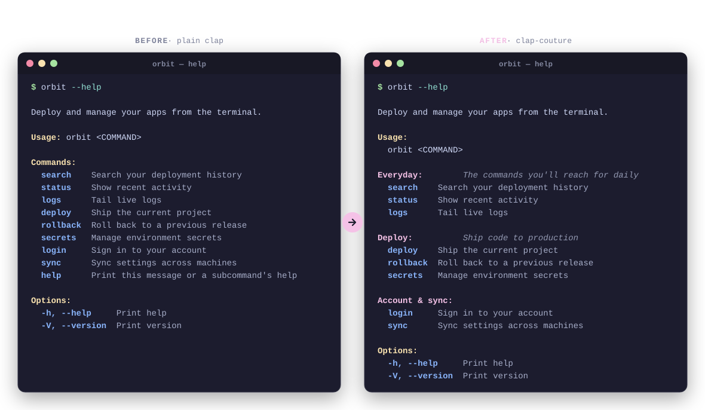

<div align="center">

<h1>clap-couture</h1>

<p>
  <strong>Haute couture for your command line.</strong><br>
  The most beautiful <code>clap</code> extension you've heard of.
</p>

<p>
  <a href="https://crates.io/crates/clap-couture"></a>
  <a href="https://docs.rs/clap-couture"></a>
  <a href="#installation"></a>
  <a href="https://crates.io/crates/clap"></a>
  <a href="LICENSE"></a>
</p>

<p>
  <a href="#quickstart">Quickstart</a> ·
  <a href="#how-it-works">How it works</a> ·
  <a href="#clap-vs-clap-couture">Comparison</a> ·
  <a href="https://docs.rs/clap-couture">Docs</a>
</p>



</div>

---

**clap-couture** is a [`clap`](https://docs.rs/clap) extension that turns a flat `--help`
into a categorized, beautifully organized command menu — grouped sections, per-category
descriptions, and Markdown styling, all from a few derive attributes.

It's not a fork and it's not a rewrite. It dresses up the CLI you already have: your
subcommands stay exactly where clap put them, so parsing, shell completions, and
`tool <cmd> --help` are untouched. Only the *listing* gets tailored.

## Why

Every clap CLI starts elegant and, around the eighth subcommand, turns into a wall.
`Commands:` becomes an undifferentiated list where `login` sits next to `import` sits
next to `search`, and the reader has to squint to find the three commands they actually
use every day.

Good CLIs organize that menu by hand — but clap gives you one flat bucket. clap-couture
gives you the bucket clap forgot: **categories**. Group commands into titled sections
with their own descriptions, in a couple of derive attributes, with the grouping
*checked at compile time*.

## Quickstart

```toml
# Cargo.toml
[dependencies]
clap = { version = "4", features = ["derive"] }
clap-couture = "0.1"
```

Add `Couture` next to clap's own derives, name your categories, and pin each command to one:

```rust
use clap::{Parser, Subcommand};
use clap_couture::Couture;

#[derive(Parser, Couture)]
#[command(name = "orbit", about = "Deploy and manage your apps from the terminal.")]
struct Cli {
    #[command(subcommand)]
    cmd: Cmd,
}

#[derive(Subcommand, Couture)]
#[couture(categories = {
    "everyday" = { title = "Everyday", description = "The commands you'll reach for daily" },
    "deploy"   = { title = "Deploy",   description = "Ship code to production" },
    "account"  = { title = "Account & sync" },
})]
enum Cmd {
    /// Search your deployment history
    #[category("everyday")]
    Search,
    /// Show recent activity
    #[category("everyday")]
    Status,
    /// Ship the current project
    #[category("deploy")]
    Deploy,
    /// Roll back to a previous release
    #[category("deploy")]
    Rollback,
    /// Sign in to your account
    #[category("account")]
    Login,
}

fn main() {
    let cli = Cli::couture_parse(); // drop-in for `Cli::parse()`
    // ...dispatch on cli.cmd exactly as before
}
```

`couture_parse()` is a drop-in for clap's `parse()`. Now `orbit --help` reads like a
menu instead of a phone book:

```text
Deploy and manage your apps from the terminal.

Usage:
  orbit <COMMAND>

Everyday:        The commands you'll reach for daily
  search    Search your deployment history
  status    Show recent activity

Deploy:          Ship code to production
  deploy    Ship the current project
  rollback  Roll back to a previous release

Account & sync:
  login     Sign in to your account

Options:
  -h, --help     Print help
  -V, --version  Print version
```

> [!TIP]
> A command with no `#[category("...")]` isn't lost — uncategorized commands render
> first, above the sections. You can adopt categories one command at a time.

## Features

- **📂 Categorized subcommands** — group your commands into titled sections instead of one flat list.
- **📝 Per-category descriptions** — give each section a one-line "what's this for," rendered in a clean column.
- **🎀 Markdown in help text** *(opt-in)* — `**bold**`, `*italic*`, and `` `code` `` in descriptions, styled with clap's own colors. Enable the `markdown` feature.
- **🛡️ Compile-time checked** — a `#[category("typo")]` that doesn't match a declared category is a **compile error**, not a silent nothing.
- **🧵 Drop-in** — `couture_parse()` replaces `parse()`; the rest of your clap code doesn't change.
- **🤝 Completions & sub-help untouched** — commands stay visible to clap, so shell completions and `tool <cmd> --help` work exactly as before.
- **🎨 Respects your styling** — inherits clap's `Styles`, and honors `NO_COLOR` / non-TTY output automatically.
- **🪶 Featherweight** — a derive macro and a bit of rendering. No runtime framework, no async, no surprises.

## How it works

`#[derive(Couture)]` behaves *by shape*, just like clap's own derives, and gives you
three ways in — pick the one that fits your app:

**1. On your parser struct — the easy path.** You get `couture_parse()` and friends
(`couture_try_parse`, `couture_parse_from`, …), drop-in replacements for clap's:

```rust
let cli = Cli::couture_parse();
```

**2. On a subcommand enum — declare the categories.** `#[couture(categories = { ... })]`
sets the section order and metadata; `#[category("...")]` assigns each variant.
Categories render in declared order; commands keep their variant order within a section.

**3. On a `clap::Command` directly — for the builder API.** No derive on your struct?
Attach couture to any `Command`:

```rust
use clap_couture::CommandExt;

let cmd = Cli::command().with_couture::<Cmd>();
```

Nested subcommands can pull in a parent's categories with
`#[couture(inherit = ["deploy"])]` (or `inherit = true` to accept any), so a child enum
can slot its commands into sections the parent owns.

## clap vs. clap-couture

clap-couture *is* clap — plus the parts of the help menu clap leaves to you.

| | plain `clap` | `clap-couture` |
|---|:---:|:---:|
| Subcommand `--help` | one flat list | grouped into categories |
| Section titles & descriptions | ✗ | ✅ |
| Markdown styling in help | ✗ | ✅ *(feature)* |
| Categories checked at compile time | — | ✅ |
| Argument parsing | ✅ | ✅ *(unchanged)* |
| Shell completions | ✅ | ✅ *(unchanged)* |
| Per-command `--help` | ✅ | ✅ *(unchanged)* |
| Extra dependencies | none | one small derive |
| Drop-in on an existing clap app | — | ✅ |

## When you might *not* want it

Honest fine print, because a wardrobe isn't for every occasion:

- **You have three subcommands.** A flat list is already readable — categories are for CLIs that have outgrown the flat list.
- **You don't use derives or subcommands.** couture's sweet spot is a subcommand enum. A single-command tool has nothing to group.
- **You want zero extra dependencies.** couture is small, but "small" isn't "none."

If none of those apply, your `--help` deserves better than a wall of flags.

## Installation

```sh
cargo add clap-couture
# markdown styling in descriptions:
cargo add clap-couture --features markdown
```

clap-couture targets **clap 4.x** and Rust **1.85+** (edition 2024).

## Roadmap

clap-couture starts where every user starts: the help menu — the most-seen, least-loved
surface of a CLI. It won't stop there. Ideas on the rack (directions, not promises):

- Themeable style presets, so "beautiful" is one line, not a `Styles` builder.
- Tailored usage and error output to match the help.
- More layout options for how sections and columns are rendered.

Have a request? Open an issue — the fitting room is open.

## FAQ

<details>
<summary><b>Does it change how my CLI parses arguments?</b></summary>

No. couture only rewrites the help *listing*. Parsing, exit codes, and error handling
are clap's, unchanged.
</details>

<details>
<summary><b>Will it break my shell completions or <code>tool &lt;cmd&gt; --help</code>?</b></summary>

No. Subcommands stay fully registered with clap; couture only groups how they're
displayed on the top-level help. Completions and per-command help work exactly as before.
</details>

<details>
<summary><b>Do I have to categorize every command?</b></summary>

No. Commands without a <code>#[category("...")]</code> render first, above the sections.
You can migrate one command at a time.
</details>

<details>
<summary><b>What if I use the builder API instead of derive?</b></summary>

Use <code>CommandExt::with_couture::&lt;T&gt;()</code> on any <code>clap::Command</code>.
The <code>T</code> just needs to implement the <code>Couture</code> trait (derive it, or
implement it by hand).
</details>

<details>
<summary><b>How does it interact with clap's colors?</b></summary>

couture inherits your command's <code>Styles</code> and reuses clap's own header and
literal styles, so the grouped help matches the rest of your output — and it respects
<code>NO_COLOR</code> and non-TTY output automatically.
</details>

## Contributing

Issues and PRs are welcome. `cargo test` runs the suite (including the compile-fail tests
that guard the derive), and there's a runnable demo:

```sh
cargo run -p clap-couture --example orbit --features markdown
```

## License

[MIT](LICENSE).
