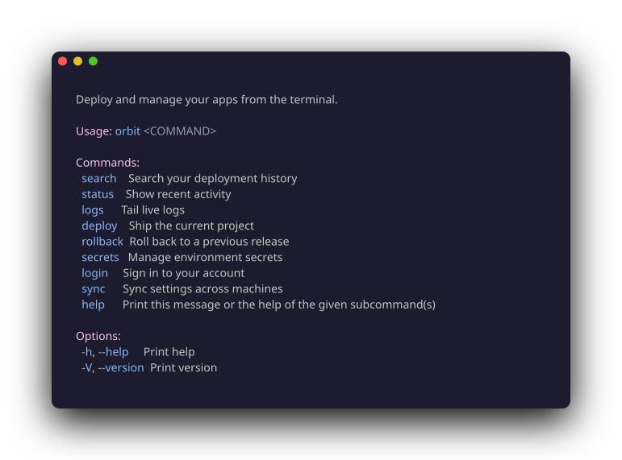
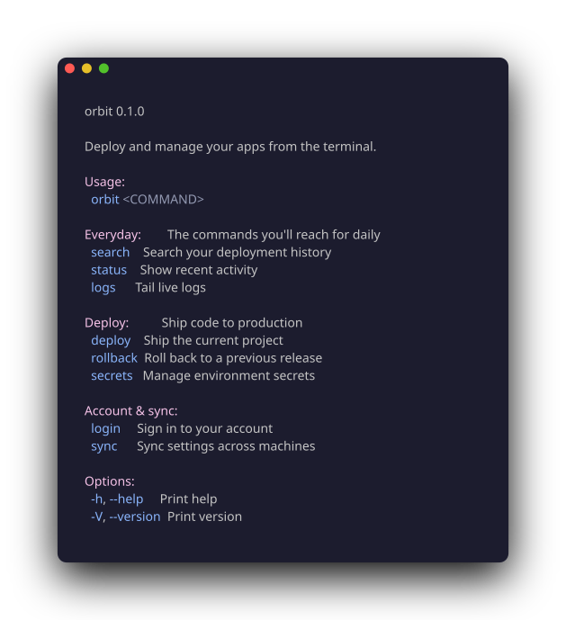

<div align="center">

<h1>clap-couture</h1>
<strong>Haute couture for your command line.</strong><br>

<p>
  <a href="https://crates.io/crates/clap-couture"></a>
  <a href="https://docs.rs/clap-couture"></a>
  <a href="https://github.com/markovejnovic/clap-couture/actions/workflows/ci.yml"></a>
  <a href="#installation"></a>
  <a href="https://crates.io/crates/clap"></a>
  <a href="LICENSE"></a>
</p>


</div>

**clap-couture** is a [`clap`](https://docs.rs/clap) extension that beautifies
your `clap` with only a few derive attributes.

## Features

- Organize your help with _categories_.
- Interactive input (WIP)
- Markdown for rich styling (WIP)

#### Categories

`clap-couture` allows you to provide a set of categories to better improve the
`--help` experience your users see. As your project gets larger, the list of
subcommands makes your CLI intimidating and we don't like that.

With `clap-couture`, you can create categories:

```rust
#[derive(Subcommand, Couture)]
#[couture(categories = {
    "everyday" = { title = "Everyday",
                   description = "The commands you'll reach for daily" },
    "deploy"   = { title = "Deploy",
                   description = "Ship code to production" },
    "account"  = { title = "Account & sync" },
})]
enum Cmd {
    #[category("deploy")] Deploy,
    #[category("account")] Login,
    #[category("everyday")] Logs,
    #[category("deploy")] Rollback,
    #[category("everyday")] Search,
    #[category("deploy")] Secrets,
    #[category("everyday")] Status,
    #[category("account")] Sync,
}
```

which will generate beautiful `--help`:

<table>
  <tr>
    <td align="center"><sub><b>PLAIN CLAP</b></sub></td>
    <td align="center"><sub><b>WITH CLAP-COUTURE</b></sub></td>
  </tr>
  <tr>
    <td valign="top"></td>
    <td valign="top"></td>
  </tr>
</table>

## Quick Start

Run

```sh
cargo add clap-couture
# markdown styling in descriptions:
cargo add clap-couture --features markdown
```

clap-couture targets **clap 4.x** and Rust **1.85+** (edition 2024).

## License

[MIT](LICENSE).
